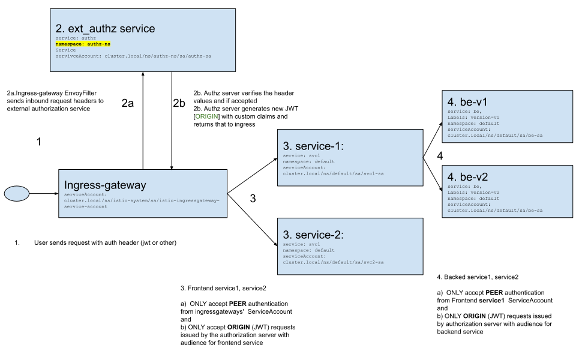
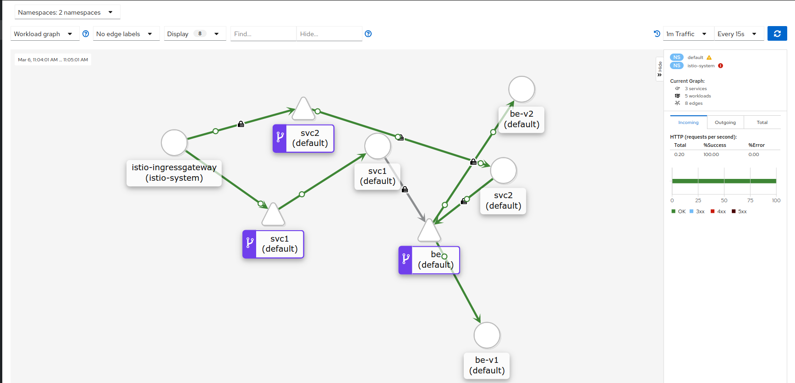
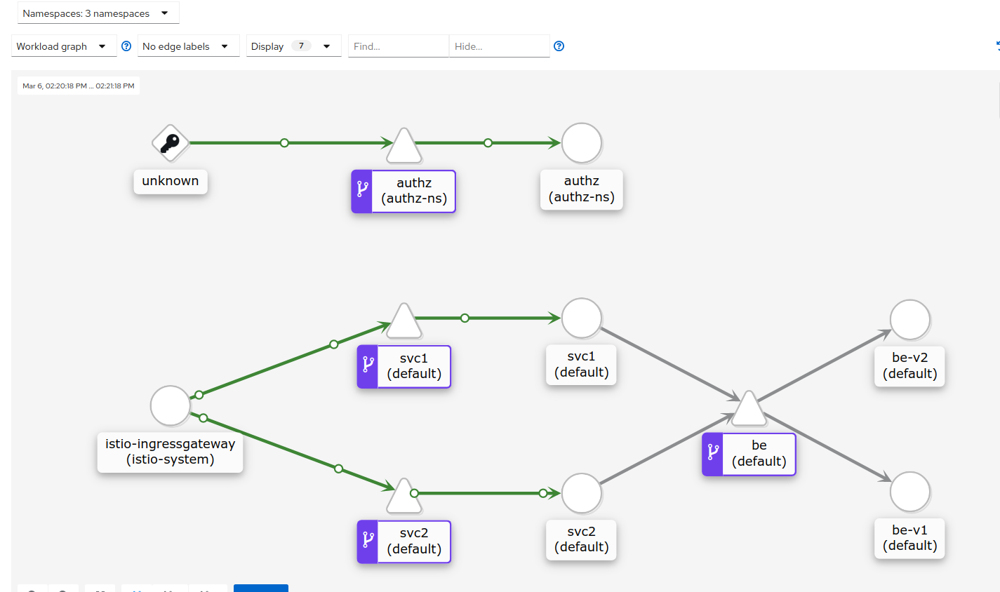

# External Authorization Server with Istio

Tutorial to setup an external authorization server for istio.  In this setup, the `ingresss-gateway` will first send the inbound request headers to another istio service which check the header values submitted by the remote user/client.  If the header values passes some criteria, the external authorization server will instruct the authorization server to proceed with the request upstream.

The check criteria can be anything (kerberos ticket, custom JWT) but in this example, it is the simple presence of the header value match as defined in configuration.

In this setup, it is important to ensure the authorization server is always (and exclusively) called by the ingress gateway and that the upstream services must accept the custom JWT token issued by the authorization server.

To that end, this configuration sets up `mTLS`, `RBAC` and `ORIGIN` authentication.  RBAC ensures service->service traffic flows between the gateway, authorization server and the upstream systems.   Each upstream service will only allow `ORIGIN` JWT tokens issued by the authorization server.




This tutorial is a continuation of the [istio helloworld](https://github.com/salrashid123/istio_helloworld) application.

### References

- [Envoy External Authorization](https://www.envoyproxy.io/docs/envoy/latest/api-v2/config/filter/http/ext_authz/v2/ext_authz.proto)
  - [Envoy External Authorization server (envoy.ext_authz) HelloWorld](https://github.com/salrashid123/envoy_external_authz)
- [Istio Security](https://istio.io/docs/concepts/security/)


### Setup

The following setup uses a Google Cloud Platform GKE cluster and Service Accounts certificates to issue the custom JWT tokens by the authorization server.  We are using GCP service accounts for the authhorization server JWTs simply because each service account on GCP has a convenient public JWK url for validation.


#### Set Environment Variables

On any GCP project, setup env vars and service accounts


```bash
export PROJECT_ID=`gcloud config get-value core/project`
export PROJECT_NUMBER=`gcloud projects describe $PROJECT_ID --format="value(projectNumber)"`
export SA_NAME=ext-authz-server

export SERVICE_ACCOUNT_EMAIL=$SA_NAME@$PROJECT_ID.iam.gserviceaccount.com

echo $PROJECT_ID
echo $PROJECT_NUMBER
echo $SA_NAME
echo $SERVICE_ACCOUNT_EMAIL
```

#### Create Service Account for the Authorization Server

```bash
gcloud iam service-accounts create $SA_NAME --display-name "Ext-Authz Server Service Account"
gcloud iam service-accounts keys  create svc_account.p12 --iam-account=$SA_NAME@$PROJECT_ID.iam.gserviceaccount.com --key-file-type=p12
```

The output should show the keyID (note this down)

 note the KeyID (eg)  `created key [7359f4d1a9a049b15d972b803c476f03cdd16957] of type [p12] as [svc_account.p12]`

```bash
export KEY_ID=`gcloud iam service-accounts keys  list --iam-account=$SERVICE_ACCOUNT_EMAIL --format="value(name)" --filter=keyType=USER_MANAGED`
echo $KEY_ID
```

Convert the key to PEM, remove the passphrase and then to base64

```bash
openssl pkcs12 -in svc_account.p12  -nocerts -nodes -passin pass:notasecret | openssl rsa -out private.pem
export SVC_ACCOUNT_KEY=`base64 -w 0 private.pem && echo`
```

Note down the base64 encoded form of the key, we will need this and the KeyID later when defining the `ConfigMap` and `Secret` for the authorization server.

### Build and push images

You can use the following prebuilt containers for this tutorial if you want to. 

If you would rather build and stage your own, the `Dockerfile` for each container is provided in this repo.   

The images we will use here has the following endpoints enabled:

* `salrashid123/svc`: Frontend service
  - `/version`:  Displays a static "version" number for the image.  If using `salrashid123/svc:1` then the version is `1`. If using `salrashid123/svc:2` the version is `2`
  - `/backend`:  Makes an HTTP Ret call to the backend service's `/backend` and `/headerz` endpoints.

* `salrashid123/besvc`: Backend Service
  - `/headerz`: Displays the http headers
  - `/backend`: Displays the pod name

* `salrashid123/ext-authz-server`: External Authorization gRPC Server
  - gRPC Authorization server running in namespace `authz-ns` as service `authz`
  - Authorization server reads an environment variable that lists the set of authorized (eg `authzallowedusers: "alice,bob"`)
    This server will read the "Authorization: Bearer <username>" header value from the incoming request to determine the username 


To build your own, create a public dockerhub images with the names specified below:

- Build External Aututhorization Server (you can ofcourse use your own dockerhub repo!)

```bash
cd authz_server/
docker build -t salrashid123/ext-authz-server .
docker push salrashid123/ext-authz-server
```
- Build Frontend
```bash
cd frontend 
docker build  --build-arg VER=1 -t salrashid123/svc:1 .
docker build  --build-arg VER=2 -t salrashid123/svc:2 .
docker push salrashid123/svc:1
docker push salrashid123/svc:2
```

- Build Backend
```bash
cd backend
docker build  --build-arg VER=1 -t salrashid123/besvc:1 .
docker build  --build-arg VER=1 -t salrashid123/besvc:2 .

docker push salrashid123/besvc:1
docker push salrashid123/besvc:2
```

### Create Cluster and install Istio

Create a `1.19+` GKE cluster (do not enable the istio addon GKE provides; we will install istio `1.7.2` manually)

```bash
gcloud container  clusters create istio-1 --machine-type "n1-standard-2" --zone us-central1-a  --num-nodes 4 \
   --enable-ip-alias --cluster-version "1.19" -q

gcloud container clusters get-credentials istio-1 --zone us-central1-a

kubectl create clusterrolebinding cluster-admin-binding --clusterrole=cluster-admin --user=$(gcloud config get-value core/account)

kubectl create ns istio-system
```

### Download and install istio 1.8.1

```bash
export ISTIO_VERSION=1.8.1

wget -P /tmp/ https://github.com/istio/istio/releases/download/$ISTIO_VERSION/istio-$ISTIO_VERSION-linux-amd64.tar.gz
tar xvf /tmp/istio-$ISTIO_VERSION-linux-amd64.tar.gz -C /tmp/
rm /tmp/istio-$ISTIO_VERSION-linux-amd64.tar.gz

export PATH=/tmp/istio-$ISTIO_VERSION/bin:$PATH

istioctl install --set profile=demo \
 --set meshConfig.enableAutoMtls=true  \
 --set values.gateways.istio-ingressgateway.runAsRoot=true \
 --set meshConfig.outboundTrafficPolicy.mode=REGISTRY_ONLY 

kubectl label namespace default istio-injection=enabled
```

After all the services are in running mode, get the `GATEWAY_IP`

```bash
kubectl get no,po,rc,svc,ing,deployment -n istio-system

kubectl get svc istio-ingressgateway -n istio-system

export GATEWAY_IP=$(kubectl -n istio-system get service istio-ingressgateway -o jsonpath='{.status.loadBalancer.ingress[0].ip}')
echo $GATEWAY_IP
```


### Deploy application

Deploy the baseline application without the external authorization server

```bash
$ kubectl apply -f app-deployment.yaml

$ kubectl get po,svc
NAME                         READY   STATUS    RESTARTS   AGE
pod/be-v1-6d55cbb9b9-dfnh9   2/2     Running   0          53s
pod/be-v2-5977896d79-rl8h9   2/2     Running   0          53s
pod/svc1-55d9cc85cb-v282q    2/2     Running   0          53s
pod/svc2-75469b454-vfn7r     2/2     Running   0          53s

NAME                 TYPE        CLUSTER-IP   EXTERNAL-IP   PORT(S)    AGE
service/be           ClusterIP   10.4.2.159   <none>        8080/TCP   54s
service/kubernetes   ClusterIP   10.4.0.1     <none>        443/TCP    6m24s
service/svc1         ClusterIP   10.4.6.40    <none>        8080/TCP   54s
service/svc2         ClusterIP   10.4.4.36    <none>        8080/TCP   54s
```

### Deploy Istio Gateway and services

```bash
$ kubectl apply -f istio-lb-certs.yaml
sleep 10
# regenerate the ingress-gateway to pickup the certs
INGRESS_POD_NAME=$(kubectl get po -n istio-system | grep ingressgateway\- | awk '{print$1}'); echo ${INGRESS_POD_NAME};
kubectl delete po/$INGRESS_POD_NAME -n istio-system
kubectl apply -f istio-ingress-gateway.yaml
kubectl apply -f istio-app-config.yaml
```

### Send Traffic

Verify traffic for the frontend and backend services.  (we're using [jq](https://stedolan.github.io/jq/download/) to help parse the response)

```bash
# Access the frontend for svc1,svc2
curl -s --cacert certs/CA_crt.pem -w " %{http_code}\n" --resolve svc1.example.com:443:$GATEWAY_IP  https://svc1.example.com/version
curl -s --cacert certs/CA_crt.pem -w " %{http_code}\n" --resolve svc2.example.com:443:$GATEWAY_IP  https://svc2.example.com/version

# Access the backend through svc1,svc2
curl -s --cacert certs/CA_crt.pem -w " %{http_code}\n" --resolve svc1.example.com:443:$GATEWAY_IP  https://svc1.example.com/backend | jq '.'
curl -s --cacert certs/CA_crt.pem -w " %{http_code}\n" --resolve svc2.example.com:443:$GATEWAY_IP  https://svc2.example.com/backend | jq '.'
```

If you would rather run this in a loop:

```bash
 for i in {1..1000}; do curl -s -w " %{http_code}\n" --cacert certs/CA_crt.pem --resolve svc1.example.com:443:$GATEWAY_IP  https://svc1.example.com/version; sleep 1; done
```

##### Kiali Dashboard

If you want, launch the kiali dashboard (default password is `admin/admin`).  In a new window, run:

```bash
kubectl apply -f https://raw.githubusercontent.com/istio/istio/release-1.8/samples/addons/prometheus.yaml
kubectl apply -f https://raw.githubusercontent.com/istio/istio/release-1.8/samples/addons/kiali.yaml
```

```
istioctl dashboard kiali
```


### Generate Authz config

Apply the preset environment variables to  `ext_authz_filter.yaml`:

```bash
export PROJECT_ID=`gcloud config get-value core/project`
export PROJECT_NUMBER=`gcloud projects describe $PROJECT_ID --format="value(projectNumber)"`
export SA_NAME=ext-authz-server
export SERVICE_ACCOUNT_EMAIL=$SA_NAME@$PROJECT_ID.iam.gserviceaccount.com
export KEY_ID=`gcloud iam service-accounts keys  list --iam-account=$SERVICE_ACCOUNT_EMAIL --format="value(name)" --filter=keyType=USER_MANAGED`
export SVC_ACCOUNT_KEY=`base64 -w 0 private.pem && echo`

echo $SERVICE_ACCOUNT_EMAIL
echo $KEY_ID
echo $SVC_ACCOUNT_KEY

envsubst < "ext_authz_filter.yaml.tmpl" > "ext_authz_filter.yaml"
```

### Apply Authz config

Now apply the authz config

```bash
kubectl apply -f ext_authz_filter.yaml
```

```bash
$ kubectl get PeerAuthentication,RequestAuthentication,AuthorizationPolicy -n authz-ns
NAME                                                                     AGE
peerauthentication.security.istio.io/ing-authzserver-peer-authn-policy   4m20s

NAME                                                                 AGE
authorizationpolicy.security.istio.io/deny-all-authz-ns              4m19s
authorizationpolicy.security.istio.io/ing-authzserver-authz-policy   4m20s


$ kubectl get PeerAuthentication,RequestAuthentication,AuthorizationPolicy -n default
NAME                                                                     AGE
requestauthentication.security.istio.io/ing-svc1-request-authn-policy    4m26s
requestauthentication.security.istio.io/ing-svc2-request-authn-policy    4m26s
requestauthentication.security.istio.io/svc-be-v1-request-authn-policy   4m26s
requestauthentication.security.istio.io/svc-be-v2-request-authn-policy   4m26s

NAME                                                            AGE
authorizationpolicy.security.istio.io/deny-all-default          4m26s
authorizationpolicy.security.istio.io/ing-svc1-authz-policy     4m26s
authorizationpolicy.security.istio.io/ing-svc2-authz-policy     4m26s
authorizationpolicy.security.istio.io/svc1-be-v1-authz-policy   93s
authorizationpolicy.security.istio.io/svc1-be-v2-authz-policy   4m25s
```

### Access Frontend

The static/demo configuration here uses two users (`alice`, `bob`), two frontend services (`svc1`,`svc2`) one backend service with two labled versions (`be`, `version=v1`,`version=v2`).

The following conditions are coded into the authorization server:

- If the authorization server sees `alice`, it issues a JWT token with `svc1` and `be` as the targets (multiple audiences)
- If the authorization server sees `bob`, it issues a JWT token with `svc2` as the target
- If the authorization server sees `carol`, it issues a JWT token with `svc1` as the target only.

```golang
var aud []string
if token == "alice" {
	aud = []string{"http://svc1.default.svc.cluster.local:8080/", "http://be.default.svc.cluster.local:8080/"}
} else if token == "bob" {
	aud = []string{"http://svc2.default.svc.cluster.local:8080/"}
} else if token == "carol" {
	aud = []string{"http://svc1.default.svc.cluster.local:8080/"}
} else {
	aud = []string{}
}
```

The net effect of that is `alice` can view `svc1`, `bob` can view `svc2` using `ORIGIN` authentication.

As Alice:

```bash
export USER=alice

curl -s \
  --cacert certs/CA_crt.pem  --resolve svc1.example.com:443:$GATEWAY_IP \
  -H "Authorization: Bearer $USER" \
  -w " %{http_code}\n"  \
   https://svc1.example.com/version


curl -s \
  --cacert certs/CA_crt.pem  --resolve svc2.example.com:443:$GATEWAY_IP \
  -H "Authorization: Bearer $USER" \
  -w " %{http_code}\n"  \
   https://svc2.example.com/version
```

```
>>> 1 200
>>> Audiences in Jwt are not allowed 403
```

As Bob:

```bash
export USER=bob

curl -s \
  --cacert certs/CA_crt.pem  --resolve svc1.example.com:443:$GATEWAY_IP \
  -H "Authorization: Bearer $USER" \
  -w " %{http_code}\n"  \
   https://svc1.example.com/version


curl -s \
  --cacert certs/CA_crt.pem  --resolve svc2.example.com:443:$GATEWAY_IP \
  -H "Authorization: Bearer $USER" \
  -w " %{http_code}\n"  \
   https://svc2.example.com/version
```

```
>>> Audiences in Jwt are not allowed 403
>>> 2 200
```

As Carol

```bash
export USER=carol

curl -s \
  --cacert certs/CA_crt.pem  --resolve svc1.example.com:443:$GATEWAY_IP \
  -H "Authorization: Bearer $USER" \
  -w " %{http_code}\n"  \
   https://svc1.example.com/version


curl -s \
  --cacert certs/CA_crt.pem  --resolve svc2.example.com:443:$GATEWAY_IP \
  -H "Authorization: Bearer $USER" \
  -w " %{http_code}\n"  \
   https://svc2.example.com/version
```

```
>>> 1 200
>>> Audiences in Jwt are not allowed 403
```



>> note, it seems the traffic from the gateway to the authorization server isn't correctly detected to be associated with the ingress-gateway (maybe a bug or some label is missing)

### Access Backend

The configuration also defines Authorization policies on the `svc1`-> `be` traffic using **BOTH** `PEER` and `ORIGIN`. 

- `PEER`:

This is done using normal RBAC service identities:

```yaml
apiVersion: security.istio.io/v1beta1
kind: AuthorizationPolicy
metadata:
 name: svc1-be-v1-authz-policy
 namespace: default
spec:
 action: ALLOW
 selector:
   matchLabels:
     app: be
     version: v1
 rules:
 - from:
   - source:
       principals: ["cluster.local/ns/default/sa/svc1-sa"]
   to:
   - operation:
       methods: ["GET"]
```

#### Backend PEER and ORIGIN

Note the `from->source->principals` denotes  the service account `svc1` runs as.

- `ORIGIN`

THis step is pretty unusual and requires some changes to application code to _forward_ its inbound authentication token. 

Recall the inbound JWT token to `svc1` for `alice` includes two audiences:

```golang
	aud = []string{"http://svc1.default.svc.cluster.local:8080/", "http://be.default.svc.cluster.local:8080/"}
```

This means we can use the same JWT token on the backend service if we setup an authentication and authz rule:

```yaml
## svc --> be-v1
apiVersion: security.istio.io/v1beta1
kind: RequestAuthentication
metadata:
 name: svc-be-v1-request-authn-policy
 namespace: default
spec:
  selector:
    matchLabels:
      app: be
      version: v1
  jwtRules:
  - issuer: "$SERVICE_ACCOUNT_EMAIL"
    audiences:
    - "http://be.default.svc.cluster.local:8080/"   
    jwksUri: "https://www.googleapis.com/service_accounts/v1/jwk/$SERVICE_ACCOUNT_EMAIL"  
    outputPayloadToHeader: x-jwt-payload  
---
apiVersion: security.istio.io/v1beta1
kind: AuthorizationPolicy
metadata:
 name: svc1-be-v1-authz-policy
 namespace: default
spec:
 action: ALLOW
 selector:
   matchLabels:
     app: be
     version: v1
 rules:
 - from:
   - source:
       principals: ["cluster.local/ns/default/sa/svc1-sa"]
   to:
   - operation:
       methods: ["GET"]
   when:
   - key: request.auth.claims[iss]
     values: ["$SERVICE_ACCOUNT_EMAIL"]
   - key: request.auth.claims[aud]
     values: ["http://be.default.svc.cluster.local:8080/"]   
```

The `RequestAuthentication` accepts a JWT token signed by the external authz server and must also include the audience of the backend (which alice's token has).  The second authorization (redundantly) rule further parses out the token and looks for the same.

Istio does not automatically forward the inbound token (though it maybe possible with `SIDECAR_INBOUND`->`SIDECAR_OUTBOUND` forwarding somehow...)...to achieve this requres some application code changes.  The folloing snippet is the code within `frontend/app.js` which take the token and uses it on the backend api call. 

>> `4/27/20`: update on the comment "(though it maybe possble with `SIDECAR_INBOUND`->`SIDECAR_OUTBOUND` forwarding somehow...)"   Its not; envoy doens't carry state from the filters forward like this.  You need to either accept and forward the header in code as shown below:

```javascript
var resp_promises = []
var urls = [
            'http://' + host + ':' + port + '/backend',
            'http://' + host + ':' + port + '/headerz',
]

out_headers = {};
if (FORWARD_AUTH_HEADER == 'true') {
    var auth_header = request.headers['authorization']; 
    logger.info("Got Authorization Header: [" + auth_header + "]");
      out_headers = {
          'authorization':  auth_header,
      };
    }

urls.forEach(element => {
     resp_promises.push( getURL(element,out_headers) )
});
```

Or configure istio to make an `OUTBOUND` ext_authz filter call.  The external authz filter will return a new Authorization server token intended for ust `svcb`.

You will also need to set [allowed_client_headers](https://www.envoyproxy.io/docs/envoy/latest/api-v2/config/filter/http/ext_authz/v2/ext_authz.proto#envoy-api-msg-config-filter-http-ext-authz-v2-authorizationresponse) so that the auth token returned by ext-authz server is sent to the upstream (in this case, upstream is `svcb`)

I think the config would be _something_ like this:

```yaml
apiVersion: networking.istio.io/v1alpha3
kind: EnvoyFilter
metadata:
  name: ext-authz-service
  namespace: default
spec:
  workloadLabels:
    app: svc1
  filters:
  - listenerMatch:
      listenerType: OUTBOUND    #  <<<<  OUTBOUND svc1->*  
      listenerProtocol: HTTP 
    insertPosition:
      index: FIRST           
    filterName: envoy.ext_authz
    filterType: HTTP
    filterConfig:
      grpc_service:
        envoy_grpc:
          cluster_name: patched.authz.authz-ns.svc.cluster.local      
          authorization_response:
            allowed_client_headers:
              patterns:
                - exact: "Authorization"
```
(ofcourse changes are needed to ext-authz server as provided in this repo..)

>> Note: i added both ORIGIN and PEER just to demonstrate this...Until its easier forward the token by envoy/istio, i woudn't recommend doing  this bit..


Anwyay, to test all this out

```bash
export USER=alice

curl -s \
  --cacert certs/CA_crt.pem  --resolve svc1.example.com:443:$GATEWAY_IP \
  -H "Authorization: Bearer $USER" \
  -w " %{http_code}\n"  \
   https://svc1.example.com/backend | jq '.'


export USER=bob

curl -s \
  --cacert certs/CA_crt.pem  --resolve svc2.example.com:443:$GATEWAY_IP \
  -H "Authorization: Bearer $USER" \
  -w " %{http_code}\n"  \
   https://svc2.example.com/backend | jq '.'

export USER=carol

curl -s \
  --cacert certs/CA_crt.pem  --resolve svc1.example.com:443:$GATEWAY_IP \
  -H "Authorization: Bearer $USER" \
  -w " %{http_code}\n"  \
   https://svc1.example.com/backend | jq '.'
```

Sample output

-Alice

Alice's TOKEN issued by the authorization server includes two audiences:

```golang
aud = []string{"http://svc1.default.svc.cluster.local:8080/", "http://be.default.svc.cluster.local:8080/"}
```

Which is allowed by backend services `RequestAuthentication` policy.

```bash
export USER=alice
curl -s \
  --cacert certs/CA_crt.pem  --resolve svc1.example.com:443:$GATEWAY_IP \
  -H "Authorization: Bearer $USER" \
  -w " %{http_code}\n"  \
   https://svc1.example.com/backend | jq '.'

[
  {
    "url": "http://be.default.svc.cluster.local:8080/backend",
    "body": "pod: [be-v2-64d9cf5fb4-mpsq5]    node: [gke-istio-1-default-pool-b516bc56-xz2c]",
    "statusCode": 200
  },
  {
    "url": "http://be.default.svc.cluster.local:8080/headerz",
    "body": "{\"host\":\"be.default.svc.cluster.local:8080\",\"x-forwarded-proto\":\"http\",\"x-request-id\":\"bb31942c-f04e-9b12-ba69-d68603a520af\",\"content-length\":\"0\",\"x-forwarded-client-cert\":\"By=spiffe://cluster.local/ns/default/sa/be-sa;Hash=2e0f9ca7bea6ac081f4c256de79ffdb4db2e55968b0ded2526e95cb89f4c36ac;Subject=\\\"\\\";URI=spiffe://cluster.local/ns/default/sa/svc1-sa\",\"x-b3-traceid\":\"cda6d87c8d342998ee1f797471592dff\",\"x-b3-spanid\":\"6dc54e848db21050\",\"x-b3-parentspanid\":\"ee1f797471592dff\",\"x-b3-sampled\":\"1\"}",
    "statusCode": 200
  }
]
```

- Bob

Bob's token does not include the backend service 

```golang
aud = []string{"http://svc2.default.svc.cluster.local:8080/"}
```

Which means the `RequestAuthentication` will fail.  Bob is only allowed to invoke `svc2` anyway


```bash
export USER=bob
curl -s \
  --cacert certs/CA_crt.pem  --resolve svc2.example.com:443:$GATEWAY_IP \
  -H "Authorization: Bearer $USER" \
  -w " %{http_code}\n"  \
   https://svc2.example.com/backend  | jq '.'

[
  {
    "url": "http://be.default.svc.cluster.local:8080/backend",
    "body": "Audiences in Jwt are not allowed",
    "statusCode": 403
  },
  {
    "url": "http://be.default.svc.cluster.local:8080/headerz",
    "body": "Audiences in Jwt are not allowed",
    "statusCode": 403
  }
]
```

- Carol

Carol's token is allowed to invoke `svc1` but does not include the issuer to pass the `RequestAuthentication` policy

```golang
aud = []string{"http://svc1.default.svc.cluster.local:8080/"}
```

```bash
export USER=carol
curl -s \
  --cacert certs/CA_crt.pem  --resolve svc1.example.com:443:$GATEWAY_IP \
  -H "Authorization: Bearer $USER" \
  -w " %{http_code}\n"  \
   https://svc1.example.com/backend | jq '.'

[
  {
    "url": "http://be.default.svc.cluster.local:8080/backend",
    "body": "Audiences in Jwt are not allowed",
    "statusCode": 403
  },
  {
    "url": "http://be.default.svc.cluster.local:8080/headerz",
    "body": "Audiences in Jwt are not allowed",
    "statusCode": 403
  }
]
```


If you would rather run these tests in a loop
```bash
 for i in {1..1000}; do curl -s \
  --cacert certs/CA_crt.pem  --resolve svc1.example.com:443:$GATEWAY_IP \
  -H "Authorization: Bearer $USER" \
  -w " %{http_code}\n"  \
   https://svc1.example.com/version; sleep 1; done
```

---

At this point, the system is setup to to always use mTLS, ORIGIN and PEER authentication plus RBAC.  If you want to verify any component of `PEER`, change the policy to change the service account that is the target service authorization policy accepts and reapply the config.  

Change either the settings `RequestAuthentication` _or_  `AuthorizationPolicy` depending on which layer you are testing

```yaml
## svc --> be-v1
apiVersion: security.istio.io/v1beta1
kind: RequestAuthentication
metadata:
 name: svc-be-v1-request-authn-policy
 namespace: default
spec:
  selector:
    matchLabels:
      app: be
      version: v1
  jwtRules:
  - issuer: "$SERVICE_ACCOUNT_EMAIL"
    audiences:
    - "http://be.default.svc.cluster.local:8080/"      ##  or CHANGE ORIGIN  <<<<  "Audiences in Jwt are not allowed"
    jwksUri: "https://www.googleapis.com/service_accounts/v1/jwk/$SERVICE_ACCOUNT_EMAIL"  
    # forwardOriginalToken: true
    outputPayloadToHeader: x-jwt-payload   
---
## svc --> be-v2
apiVersion: security.istio.io/v1beta1
kind: RequestAuthentication
metadata:
 name: svc-be-v2-request-authn-policy
 namespace: default
spec:
  selector:
    matchLabels:
      app: be
      version: v2
  jwtRules:
  - issuer: "$SERVICE_ACCOUNT_EMAIL"
    audiences:
    - "http://be.default.svc.cluster.local:8080/"   ##  or CHANGE ORIGIN  <<<<  "Audiences in Jwt are not allowed"
    jwksUri: "https://www.googleapis.com/service_accounts/v1/jwk/$SERVICE_ACCOUNT_EMAIL" 
    # forwardOriginalToken: true
    outputPayloadToHeader: x-jwt-payload
---
apiVersion: security.istio.io/v1beta1
kind: AuthorizationPolicy
metadata:
 name: svc1-be-v1-authz-policy
 namespace: default
spec:
 action: ALLOW
 selector:
   matchLabels:
     app: be
     version: v1
 rules:
 - from:
   - source:
       principals: ["cluster.local/ns/default/sa/svc1-sa"]    #  CHANGE  PEER  <<<<  "RBAC: access denied"
   to:
   - operation:
       methods: ["GET"]
   when:
   - key: request.auth.claims[iss]
     values: ["$SERVICE_ACCOUNT_EMAIL"]        ##  or CHANGE ORIGIN at Authz <<<<  "RBAC: access denied"
   - key: request.auth.claims[aud]
     values: ["http://be.default.svc.cluster.local:8080/"]          
---
apiVersion: security.istio.io/v1beta1
kind: AuthorizationPolicy
metadata:
 name: svc1-be-v2-authz-policy
 namespace: default
spec:
 action: ALLOW
 selector:
   matchLabels:
     app: be
     version: v2
 rules:
 - from:
   - source:
       principals: ["cluster.local/ns/default/sa/svc1-sa"]   # CHANGE PEER <<<<  "RBAC: access denied"
   to:
   - operation:
       methods: ["GET"]
   when:
   - key: request.auth.claims[iss]
     values: ["$SERVICE_ACCOUNT_EMAIL"]        ##  or CHANGE ORIGIN at Authz <<<<  "RBAC: access denied"
   - key: request.auth.claims[aud]
     values: ["http://be.default.svc.cluster.local:8080/"]            
```
then reapply the config and access the backend as `alice`

```bash
export USER=alice
curl -s \
  --cacert certs/CA_crt.pem  --resolve svc1.example.com:443:$GATEWAY_IP \
  -H "Authorization: Bearer $USER" \
  -w " %{http_code}\n"  \
   https://svc1.example.com/backend | jq '.'


[
  {
    "url": "http://be.default.svc.cluster.local:8080/backend",
    "body": "RBAC: access denied",
    "statusCode": 403
  },
  {
    "url": "http://be.default.svc.cluster.local:8080/headerz",
    "body": "RBAC: access denied",
    "statusCode": 403
  }
]
```

Finally, the external server is attached to the ingress gateway but you could also attach it to a sidecar for an endpoint.  In this mode, the authorization decision is done not at the ingress gateway but locally on a service's sidecar.  To use that mode, define the `EnvoyFilter` workloadLabel and listenerType. eg:

```yaml
apiVersion: networking.istio.io/v1alpha3
kind: EnvoyFilter
metadata:
  name: svc1-authz-filter
  namespace: default
spec:
  workloadSelector:
    labels:
      app: svc1
  configPatches:
    - applyTo: HTTP_FILTER
      match:
        context: SIDECAR_INBOUND
        listener:
          filterChain:
            filter:
              name: "envoy.http_connection_manager"
              subFilter:
                name: "envoy.router"
      patch:
        operation: INSERT_FIRST
        value:
         name: envoy.ext_authz
         config:
           grpc_service:
             envoy_grpc:
               cluster_name: patched.authz.authz-ns.svc.cluster.local
```

If you do this, you will have to setup PEER policies that allow the service to connect and use the authorization server.

---

### Debugging

You can debug issues using these resources

- [Debugging Envoy and Istio](https://istio.io/docs/ops/diagnostic-tools/proxy-cmd/)
- [Security Problems](https://istio.io/docs/ops/common-problems/security-issues/)

To set the log level higher and inspect a pod's logs:

```bash
istioctl manifest apply --set values.global.proxy.accessLogFile="/dev/stdout"
```

- Ingress pod

```bash
INGRESS_POD_NAME=$(kubectl get po -n istio-system | grep ingressgateway\- | awk '{print$1}'); echo ${INGRESS_POD_NAME};

kubectl exec -ti $INGRESS_POD_NAME -n istio-syste -- /bin/bash
istioctl proxy-config log  $INGRESS_POD_NAME --level debug
kubectl logs -f --tail=0 $INGRESS_POD_NAME -n istio-system
istioctl dashboard envoy $INGRESS_POD_NAME.istio-system
istioctl experimental  authz check  $INGRESS_POD_NAME.istio-system
```

```bash
$ istioctl experimental  authz check  $INGRESS_POD_NAME.istio-system
Checked 2/2 listeners with node IP 10.48.2.5.
LISTENER[FilterChain]     CERTIFICATE                                 mTLS (MODE)     JWT (ISSUERS)     AuthZ (RULES)
0.0.0.0_80                none                                        no (none)       no (none)         no (none)
0.0.0.0_443               /etc/istio/ingressgateway-certs/tls.crt     no (none)       no (none)         no (none)

$ istioctl authn tls-check  $INGRESS_POD_NAME.istio-system authz.authz-ns.svc.cluster.local
HOST:PORT                                  STATUS     SERVER     CLIENT     AUTHN POLICY     DESTINATION RULE
authz.authz-ns.svc.cluster.local:50051     AUTO       STRICT     -          /default         -
```

- Authz pod

```bash
AUTHZ_POD_NAME=$(kubectl get po -n authz-ns | grep authz\- | awk '{print$1}'); echo ${AUTHZ_POD_NAME};
istioctl proxy-config log  $AUTHZ_POD_NAME -n authz-ns  --level debug
kubectl logs -f --tail=0 $AUTHZ_POD_NAME -c authz-container -n  authz-ns
istioctl dashboard envoy $AUTHZ_POD_NAME.authnz-ns
istioctl experimental  authz check $AUTHZ_POD_NAME.authz-ns
```

- SVC1 pod

```bash
SVC1_POD_NAME=$(kubectl get po -n default | grep svc1\- | awk '{print$1}'); echo ${SVC1_POD_NAME};

$ istioctl authn tls-check  $SVC1_POD_NAME.default be.default.svc.cluster.local
HOST:PORT                             STATUS     SERVER     CLIENT           AUTHN POLICY     DESTINATION RULE
be.default.svc.cluster.local:8080     OK         STRICT     ISTIO_MUTUAL     /default         default/be-destination
```

- SVC2 pod

```bash
SVC2_POD_NAME=$(kubectl get po -n default | grep svc2\- | awk '{print$1}'); echo ${SVC2_POD_NAME};

$ istioctl authn tls-check  $SVC2_POD_NAME.default be.default.svc.cluster.local
HOST:PORT                             STATUS     SERVER     CLIENT           AUTHN POLICY     DESTINATION RULE
be.default.svc.cluster.local:8080     OK         STRICT     ISTIO_MUTUAL     /default         default/be-destination
```

### Using Google OIDC ORIGIN authentication at Ingress

If you want to use OIDC JWT authentication at the ingress gateway and then have that token forwarded to the
external authz service, apply the `RequestAuthentication` policies on the ingress gateway  as shown in the equivalent
Envoy configuration [here](https://github.com/salrashid123/envoy_iap/blob/master/envoy_google.yaml#L32).
You can generate an `id-token` using the script found under `jwt_client/` folder.

### Debugging

```
kubectl get pods -n istio-system -o name -l istio=ingressgateway | sed 's|pod/||' | while read -r pod; do istioctl proxy-config log "$pod" -n istio-system --level rbac:debug; done
```